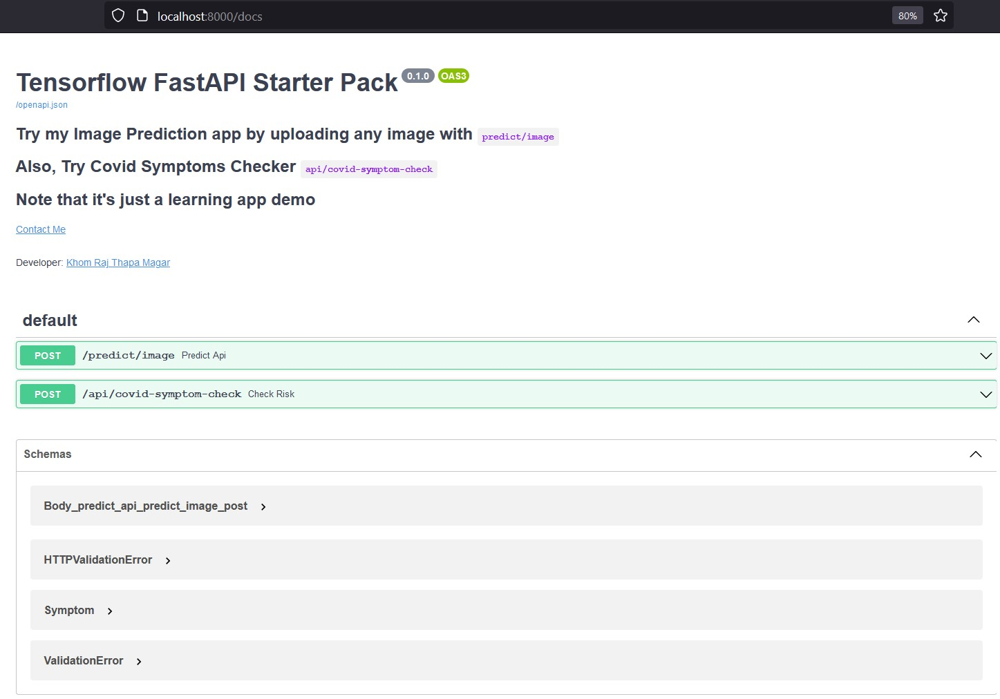
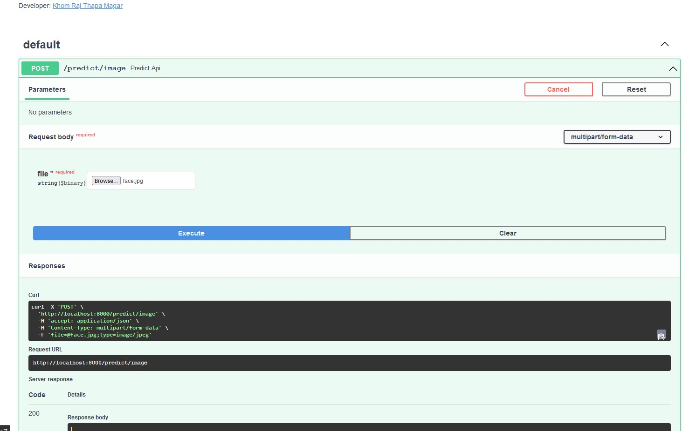
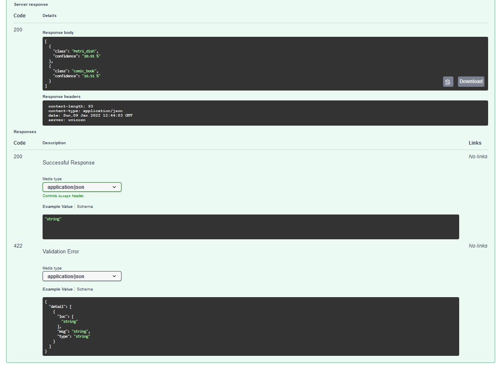
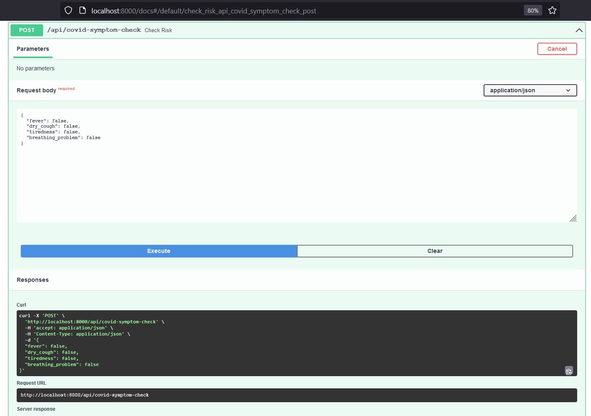
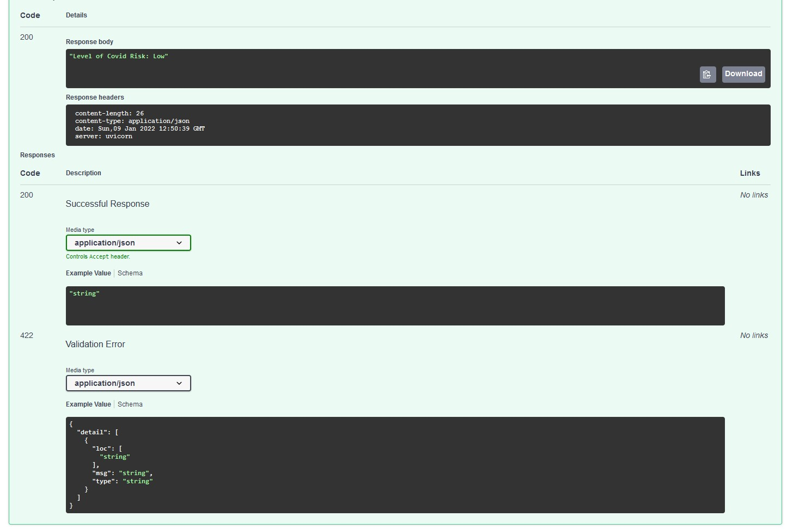
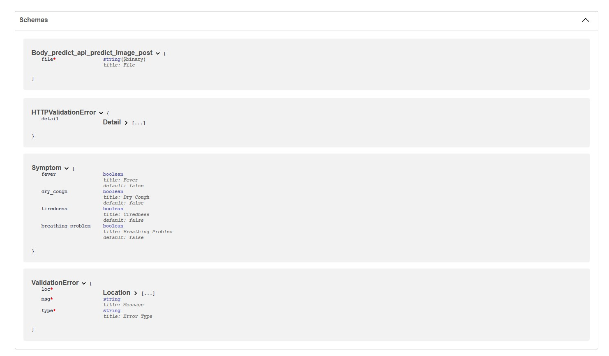

# tensorflow-web-app-starter-pack

This web app is created with FastAPI which is high performance asynchronous library for fast development of APIs.

It automatically generates SwaggeredUI for APIs.

Upload any of your preferred photo and try it at 

## How to run?
```
uvicorn imageRecognitionAPI.server.main:app
```

## Screenshots:
## SwaggerUI


## Responses
### Response of predict image api:





### Response of symptom-check api:






### See Pdf:


